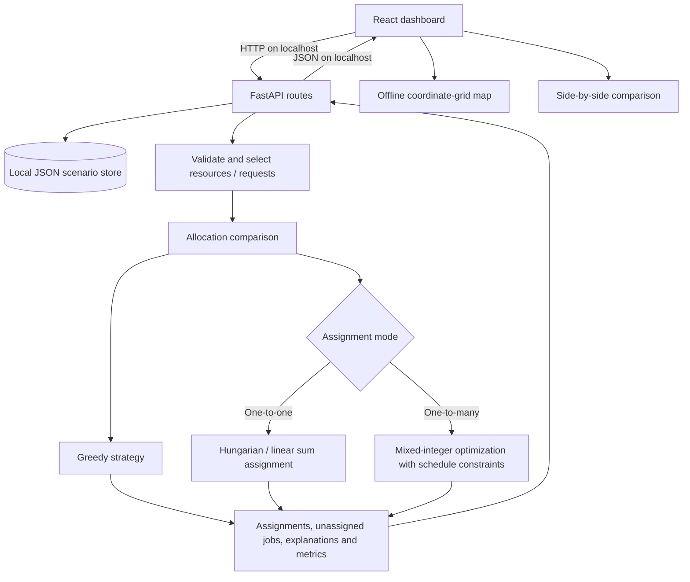
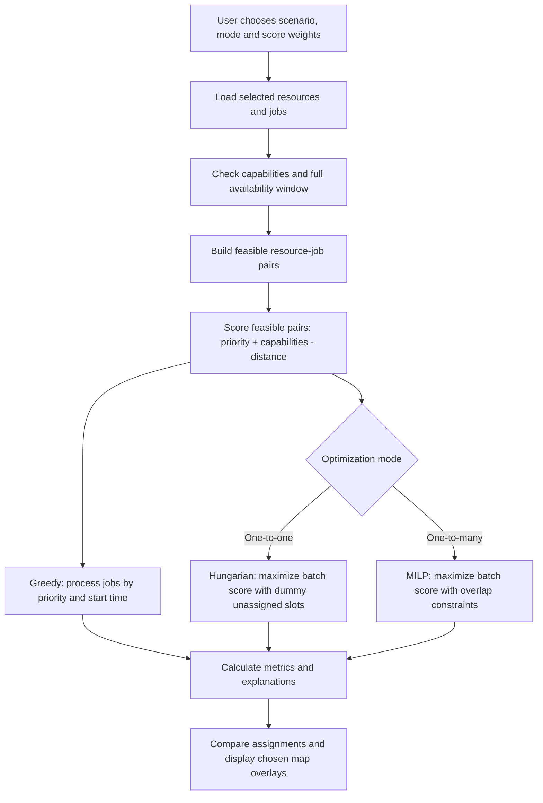
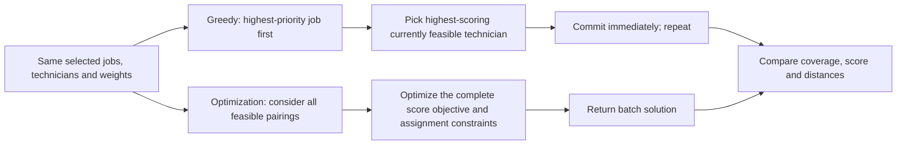

# Resource Allocation Engine

A local-first **field-service technician allocation** demonstration for the technical assessment. Built with **FastAPI + Python/SciPy**, **React/Vite**, and **Leaflet**. No API keys or paid services.

## What it does

- Manage technicians (coordinates, working window, capabilities) and jobs (coordinates, required skills, start/end, priority 1–5).
- Run **Greedy** and **batch optimization** on the same selected subset. Inspect both sets of assignments, explanations, unassigned work, and metrics.
- Use **one-to-one** mode (each technician at most once) or **one-to-many** (technicians can handle multiple jobs provided their time windows do not overlap).
- Compare total score, coverage, average/total travel distance, and assigned/unassigned counts.
- On the allocation map select **Greedy**, **Hungarian / Global Optimization**, or **Both algorithms**. Resource markers are blue; request markers are red. Greedy assignment lines are solid blue, optimized lines are dashed orange.
- Store changes locally in `backend/data/store.json` (seed scenario is created automatically when this file is absent).

## Architecture and processing flow

The browser runs a React dashboard; data and assignment decisions are handled locally by FastAPI. Neither the allocation calculation nor the map rendering calls an online service.



### Allocation decision flow



The score uses the great-circle (haversine) distance in kilometres; it does **not** model road travel time. Hard feasibility checks exclude mismatched skills and jobs outside a technician's availability. One-to-many scheduling additionally prevents jobs assigned to the same technician from overlapping.

### Greedy versus batch optimization



**Worked one-to-one example (conceptual, not a measured benchmark):** Two technicians are available at the same time. Technician A has both electrical and plumbing skills; technician B has only electrical skills. Job 1 needs electrical work, has higher priority, and is nearer A than B. Job 2 needs plumbing work and can be handled only by A. Greedy may allocate A to Job 1 first, leaving Job 2 unassigned. Batch optimization can instead give Job 1 to B and Job 2 to A, provided the combined modeled score exceeds the greedy alternative. This illustrates why global consideration can improve coverage or score, **not** a guarantee that it does so for every input.

### Offline map selection

The map supports **Greedy only**, **Optimized only**, or **Both**: solid blue lines show Greedy assignments and dashed orange lines show optimized assignments. All map graphics are generated locally from the selected scenario's coordinates, with no internet map tiles or CDN assets. Coincident assignments may overlap; inspect the tooltip and comparison panels for details.

## Installation and run

The application runs on **macOS (Apple Silicon or Intel), Windows, and Linux**. You need Python **3.13 (validated baseline)**, Node.js (LTS recommended), and npm. Run the backend and frontend in separate Terminal/PowerShell windows. No API key, hosted backend, paid map provider, or internet connection is required **at runtime**.

### macOS — Terminal (Apple Silicon or Intel)

1. Install Python 3.13 and Node.js LTS if they are not already installed. Verify both are available:

   ```bash
   python3 --version
   node --version
   npm --version
   ```

2. Open **Terminal 1**, navigate to the extracted project directory, and start the backend:

   ```bash
   cd /path/to/resource-allocation-engine/backend
   python3 -m venv .venv
   source .venv/bin/activate
   python -m pip install -r requirements.txt
   python -m uvicorn app.main:app --host 127.0.0.1 --port 8000
   ```

3. Open **Terminal 2**, navigate to the project's frontend folder, and start React:

   ```bash
   cd /path/to/resource-allocation-engine/frontend
   npm ci
   npm run dev -- --host 127.0.0.1
   ```

4. Open **http://localhost:5173** in a browser. The API runs at **http://localhost:8000** and the interactive API documentation at **http://localhost:8000/docs**. Keep both terminals running; press **Ctrl+C** in each to stop.

To run backend tests on macOS, use another Terminal session:

```bash
cd /path/to/resource-allocation-engine/backend
source .venv/bin/activate
python -m pytest -q
```

To check the frontend production build:

```bash
cd /path/to/resource-allocation-engine/frontend
npm run build
```

### Windows — PowerShell

1. Install Python 3.13 and Node.js LTS if needed. Verify:

   ```powershell
   py --version
   node --version
   npm --version
   ```

2. Open **PowerShell 1** in the extracted project's `backend` folder:

   ```powershell
   cd C:\path\to\resource-allocation-engine\backend
   py -m venv .venv
   .\.venv\Scripts\Activate.ps1
   python -m pip install -r requirements.txt
   python -m uvicorn app.main:app --host 127.0.0.1 --port 8000
   ```

   If the activation script is blocked by your PowerShell execution policy, **do not change machine-wide policy**; use `.\.venv\Scripts\python.exe -m pip install -r requirements.txt` and `.\.venv\Scripts\python.exe -m uvicorn app.main:app --host 127.0.0.1 --port 8000` instead.

3. Open **PowerShell 2** in `frontend`:

   ```powershell
   cd C:\path\to\resource-allocation-engine\frontend
   npm ci
   npm run dev -- --host 127.0.0.1
   ```

4. Open **http://localhost:5173**. To test the backend, activate its virtual environment (or use its Python executable), then run `python -m pytest -q` from `backend`. To build the frontend, run `npm run build` from `frontend`.

### Running offline and installing on a completely disconnected laptop

- **Runtime:** Once Python/Node dependencies are installed, disconnect Wi-Fi/Ethernet. Both servers, allocation algorithms, CRUD operations, metrics, and the map's **local coordinate-grid visualization** work without network access. The browser communicates only with the local FastAPI server (`127.0.0.1`); there are **no online street-map tiles**, external CDN fonts/scripts, remote analytics, or API keys.
- **First installation:** `pip install` and `npm ci` normally download open-source dependencies and therefore generally need internet access **once**. On a laptop that has never been online, provision Python, Node.js, compatible Python wheels and npm dependencies using approved offline installation media or a prepopulated local package cache. Ensure the packages match the laptop's **OS, CPU architecture, and Python/Node versions**. The submission ZIP contains source and lock/dependency manifests, **not** cross-platform vendor packages; extracting the ZIP alone on a pristine air-gapped machine does not install dependencies.
- Install dependencies separately on each operating system; **never copy `node_modules` or `.venv` between Windows and macOS**. After installing locally, npm and pip are no longer used when simply starting the two servers.

## Running tests

```bash
cd backend
python -m pytest -q
```

The backend suite includes 172 passing tests (parameterized unit scenarios and in-process HTTP integration). It covers empty inputs, hard capability/availability constraints, one-to-one and one-to-many conflicts, adjacent and overlapping time windows, variable resource/request counts, assignment uniqueness, coverage accounting, distance symmetry, decision-score comparisons, persisted CRUD, selection filters, malformed payloads and error responses. These are automated behavioral checks, not 172 independent browser workflows. HTTP integration tests use an isolated temporary JSON store and do not alter your own scenario.

Frontend static build check: `cd frontend && npm ci && npm run build`. This is **not** a substitute for a browser E2E run; automated browser-driving tests are not included. Node/npm dependency installation needs a platform-specific optional Rollup binary; an archive of Windows `node_modules` cannot be used as-is on macOS or Linux. The frontend build could not be completed in the Linux validation environment due to the missing Rollup binary. Run `npm ci` on the target platform and verify the build before submission.

## API

| Method | Endpoint | Purpose |
|---|---|---|
| GET | `/api/health` | Health check |
| GET | `/api/scenario` | List resources and requests |
| POST | `/api/resources` | Add technician |
| POST | `/api/requests` | Add job |
| DELETE | `/api/resources/{id}` | Delete technician |
| DELETE | `/api/requests/{id}` | Delete job |
| POST | `/api/allocate` | Compare both algorithms for an assignment mode and selected IDs |

`POST /api/allocate` example:

```json
{
  "resource_ids": null,
  "request_ids": null,
  "assignment_mode": "one_to_many",
  "distance_weight": 1.0,
  "priority_weight": 2.0
}
```

`null` means include all resources or requests. The response contains `results` (both algorithm assignments, explanations, unassigned IDs and metrics), a `winner`, and the selected scenario.

## Algorithms and constraints

**Greedy:** sorts jobs primarily by descending priority and picks the highest-scoring currently feasible technician for each. Fast and simple, but can make choices that are not globally best.

**Hungarian (one-to-one):** uses SciPy's `linear_sum_assignment` to find the globally optimal one-to-one matching for the constructed batch objective, subject to capability/availability restrictions. **Global Optimization (one-to-many):** formulates the assignment with schedule-conflict constraints using SciPy MILP rather than calling the Hungarian algorithm, since repeated technician assignments with time conflicts are not a standard linear assignment problem.

**Hard constraints:** every requested skill must be present, the entire job interval must fit in the technician's available window, and conflicting jobs cannot share one technician in one-to-many mode. One-to-one additionally forbids repeated technician use. A request is assigned at most once.

**Soft objective:** each feasible pair has a score based on priority, matching capability bonus and straight-line distance (haversine kilometers), with editable distance and priority weights. Explanations include distance, priority, and skill match. The optimization is based on this model, not real travel-time routing.

**Winner:** determined by backend comparison metrics. Review the numeric outcome rather than assuming the optimized result always improves every individual metric; total distance and coverage can trade off against score.

## Assessment comparison / brief analysis

Greedy is easy to explain and usually fast. It commits to its early decisions and may consume a technician that a later job needs more. Batch optimization considers the entire input simultaneously, so in one-to-one mode it can improve the overall assignment objective. In one-to-many mode, MILP adds temporal compatibility across jobs. Optimized does not necessarily mean shorter total travel distance if your score weights reward high-priority coverage.

To reproduce comparisons, run both modes on the seeded scenario, change the scoring weights, and inspect `total_score`, `coverage_pct` and `total_distance_km` for each. **Do not claim measured speedups or percentage improvements without recording an actual run on your data.**

## Limitations and design decisions

- Geographic distance is straight-line, not road routing; there are no traffic or travel-time feasibility constraints between successive jobs.
- Resource availability is a single window, not a recurring shift/calendar system.
- Data persists locally as JSON and is intended for a single local user; no database concurrency, identity, or authentication.
- The map uses a local coordinate grid instead of an online street basemap, so the entire visual interface remains available offline. It shows straight-line geographic relationships, not roads.
- The map overlays both algorithms with different line colors/patterns; completely coincident assignments can overlap visually, but the styles and per-line tooltips distinguish them.
- The E2E tests exercise the real HTTP application through an in-process client, not a full browser. Conduct a manual browser smoke test for map rendering and control changes after installing dependencies on your machine.

## Project layout

```text
backend/
  app/main.py                 FastAPI routes and validation
  app/allocator.py            Stable strategy entry points
  app/greedy_strategy.py      Sequential greedy allocation
  app/hungarian_strategy.py   One-to-one batch optimization
  app/global_strategy.py      One-to-many MILP allocation
  app/comparison.py           Winner/metric comparison
  app/allocation_common.py    Constraints, scores, metrics, distance
  app/models.py               Domain models
  app/storage.py              Local JSON persistence
  app/data.py                 Seed scenario
  tests/                     Unit and HTTP integration tests
  requirements.txt
frontend/
  src/main.jsx                React entry point
  src/App.jsx                 Dashboard sections and UI composition
  src/hooks/                 Scenario state, selection and allocation logic
  src/components/            Forms, tables, results and map
  src/config.js               API and form defaults
  src/styles.css              Ordered local CSS imports
  src/styles/                Split style sections
  package.json
  package-lock.json
```

## Submission

The ZIP contains the application source, tests, dependency manifests and this README. From the project root, run backend tests, launch both servers, allocate in each mode, switch the map between Greedy / Optimized / Both, and confirm the metrics and tooltips correspond to the visible assignments.
