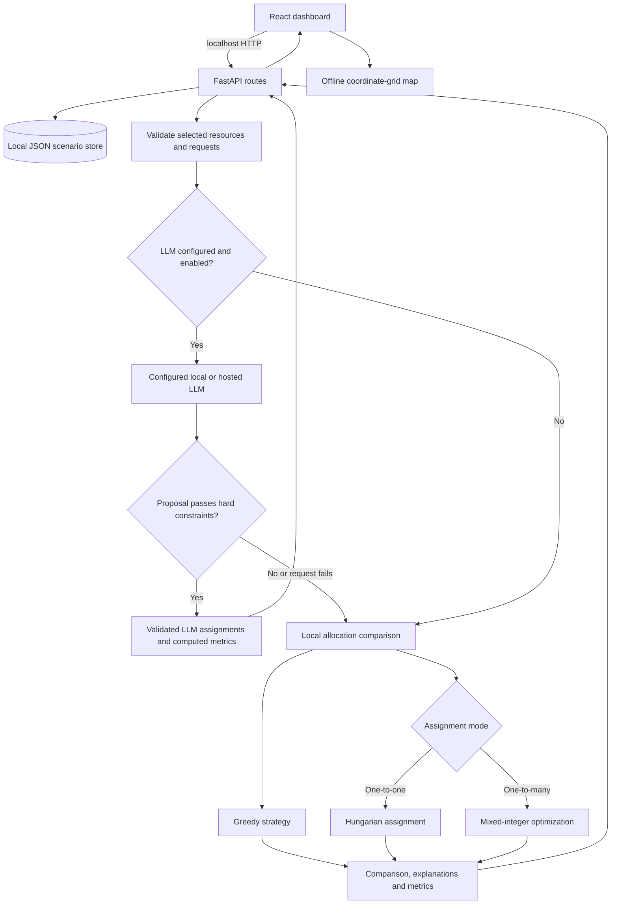
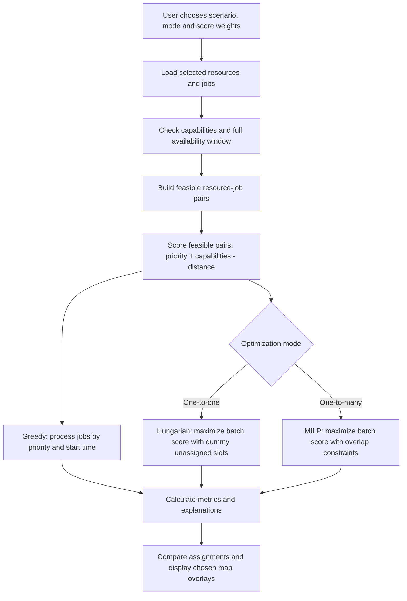
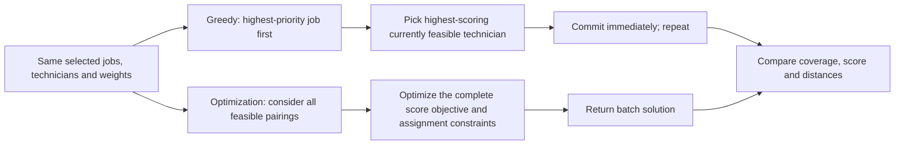
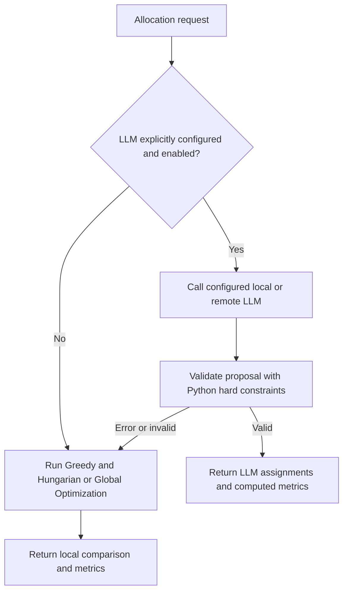

# Resource Allocation Engine

A field-service technician allocation application with offline-capable deterministic optimization and an optional configured LLM allocation provider. Built with **FastAPI + Python/SciPy** and **React/Vite + Leaflet**. The default installation requires no API keys or paid services.

## What it does

- Manage technicians (coordinates, working window, capabilities) and jobs (coordinates, required skills, start/end, priority 1–5).
- Run **Greedy** and **batch optimization** on the same selected subset. Inspect both sets of assignments, explanations, unassigned work, and metrics.
- Use **one-to-one** mode (each technician at most once) or **one-to-many** (technicians can handle multiple jobs provided their time windows do not overlap).
- Compare total score, coverage, average/total travel distance, and assigned/unassigned counts.
- On the allocation map select **Greedy**, **Hungarian / Global Optimization**, or **Both algorithms**; when the LLM is configured and succeeds, it replaces the local comparison for that run. Resource markers are blue; request markers are red. Greedy assignment lines are solid blue, optimized lines are dashed orange; LLM assignment lines are dotted green.
- Store changes locally in `backend/data/store.json` (seed scenario is created automatically when this file is absent).

## Performance metrics at a glance

The following result was measured locally on Windows 11 using `benchmark_load.py` with a synthetic matched one-to-one dataset. 
It measures the allocation engine directly, not FastAPI, storage, or browser rendering.

| Metric | Measured result |
| --- | ---: |
| Resources | 200,000 |
| Requests | 200,000 |
| Assigned / unassigned | 200,000 / 0 |
| Coverage | 100% |
| Dataset generation | 1.457 s |
| Allocation execution | 39.887 s |
| Assignment validation | 0.292 s |
| Total execution | 41.636 s |
| Peak process resident memory | 457.6 MiB |
| Algorithm | `scalable_heuristic` |
| Hard-constraint validation | Passed |
| Guaranteed global optimality | No |
| Environment | Windows 11, Python 3.14.8 |

These measurements apply to the stated synthetic workload and machine; they are not guaranteed capacity or performance limits.

**Allocation comparison metrics:** `assigned_count`, `unassigned_count`, `coverage_pct`, `total_score`, `total_distance_km`, and average distance allow Greedy and Hungarian/Global Optimization results to be evaluated on the *same* scenario. The winner is computed from the application's configured objective. See [Algorithm comparison and analysis](#algorithm-comparison-and-analysis) for interpretation; no side-by-side numerical comparison is claimed without a recorded run on identical inputs.

## Architecture and processing flow

The browser runs a React dashboard backed by FastAPI. Without LLM configuration, allocation runs locally using deterministic algorithms. With LLM enabled, the backend calls the configured provider; remote providers require network access. The map renders locally in both modes.



### Local allocation decision flow

When LLM configuration is absent, disabled, or the LLM proposal fails validation, the local path follows this process:



The score uses the great-circle (haversine) distance in kilometres; it does **not** model road travel time. Hard feasibility checks exclude mismatched skills and jobs outside a technician's availability. One-to-many scheduling additionally prevents jobs assigned to the same technician from overlapping.

### Greedy versus batch optimization



**Worked one-to-one example (conceptual, not a measured benchmark):** Two technicians are available at the same time. Technician A has both electrical and plumbing skills; technician B has only electrical skills. Job 1 needs electrical work, has higher priority, and is nearer A than B. Job 2 needs plumbing work and can be handled only by A. Greedy may allocate A to Job 1 first, leaving Job 2 unassigned. Batch optimization can instead give Job 1 to B and Job 2 to A, provided the combined modeled score exceeds the greedy alternative. This illustrates why global consideration can improve coverage or score, **not** a guarantee that it does so for every input.

### Offline map selection

When using the deterministic allocation path, the map supports **Greedy only**, **Optimized only**, or **Both**: solid blue lines show Greedy assignments and dashed orange lines show optimized assignments. All map graphics are generated locally from the selected scenario's coordinates, with no internet map tiles or CDN assets. Coincident assignments may overlap; inspect the tooltip and comparison panels for details.

## Optional LLM allocation engine (local or hosted)

The server uses **one allocation path per request**. Without explicit LLM configuration,
it computes and compares **Greedy** and **Hungarian** (one-to-one) or **Global
Optimization** (one-to-many) as before. When `LLM_ENABLED=true`, `LLM_MODEL` is set,
and a supported provider is configured, the **LLM alone proposes the allocation**.
There is no additional third-strategy comparison in this mode. Each LLM proposal is
independently checked for capability, availability, duplicate requests and schedule
conflicts, and scores/metrics are calculated by Python. If the LLM is unreachable,
times out, or returns invalid assignments, the server **falls back to the original
Greedy and optimized pair**. The API's `llm_status` fields (`configured`, `attempted`,
`used`, `fallback_reason`) identify which path actually ran.

### Local Ollama (offline runtime)

Install Ollama and a model in advance, then set these environment variables before
starting the backend:

```bash
export LLM_ENABLED=true
export LLM_PROVIDER=ollama
export LLM_MODEL=YOUR_INSTALLED_MODEL
export LLM_BASE_URL=http://127.0.0.1:11434
```

Windows PowerShell:

```powershell
$env:LLM_ENABLED = "true"
$env:LLM_PROVIDER = "ollama"
$env:LLM_MODEL = "YOUR_INSTALLED_MODEL"
$env:LLM_BASE_URL = "http://127.0.0.1:11434"
```

### Hosted or local OpenAI-compatible API (optional)

```bash
export LLM_ENABLED=true
export LLM_PROVIDER=openai_compatible
export LLM_MODEL=YOUR_MODEL_NAME
export LLM_BASE_URL=https://your-provider.example/v1
export LLM_API_KEY=YOUR_KEY
```

The supported `LLM_PROVIDER` identifiers are `ollama`, `openai_compatible`,
`openai`, `groq`, `openrouter`, `together`, `lmstudio`, `vllm`, and
`azure_openai` (only endpoints exposing the standard OpenAI-compatible `/v1`
chat-completions interface). Apart from Ollama, these names all resolve to the
same OpenAI-compatible protocol adapter. Configure `LLM_BASE_URL` explicitly
for each service; no vendor endpoint is inferred automatically. For example,
Groq can use `LLM_PROVIDER=groq` with its compatible `/openai/v1` endpoint.
Provider-specific APIs such as native Anthropic Messages and native Gemini
are not implemented. Compatibility depends on the selected model supporting
chat-completions requests and JSON output; a rejected request automatically
falls back to deterministic algorithms. This registry does not guarantee
interoperability with every model or endpoint.

Hosted providers require internet and may incur charges; they are **never required**
for the default offline deployment. Remote endpoints require HTTPS and an API key. Only local
`localhost`/loopback endpoints may use HTTP. Do not commit actual keys or `.env`
files. The provided `.env.example` is documentation only; environment variables
must be provided to the backend process. `use_llm: false` in an allocation request
forces the deterministic path even with server-side configuration.



When LLM mode succeeds, the map displays the LLM assignment set; otherwise it
supports individual or combined local algorithm assignment views. The standard test
suite mocks remote/model requests so it can run without an LLM process or internet.


## Installation and run

The application runs on **macOS (Apple Silicon or Intel), Windows, and Linux**. You need Python **3.13 (validated baseline)**, Node.js (LTS recommended), and npm. Run the backend and frontend in separate Terminal/PowerShell windows. No API key, hosted backend, paid map provider, or internet connection is required **at runtime**.

### macOS — Terminal (Apple Silicon or Intel)

1. Install Python 3.13 and Node.js LTS if they are not already installed. Verify both are available:

   ```bash
   python3 --version
   node --version
   npm --version
   ```

2. Open **Terminal 1**, navigate to the extracted project directory, and start the backend:

   ```bash
   cd /path/to/resource-allocation-engine/backend
   python3 -m venv .venv
   source .venv/bin/activate
   python -m pip install -r requirements.txt
   python -m uvicorn app.main:app --host 127.0.0.1 --port 8000
   ```

3. Open **Terminal 2**, navigate to the project's frontend folder, and start React:

   ```bash
   cd /path/to/resource-allocation-engine/frontend
   npm ci
   npm run dev -- --host 127.0.0.1
   ```

4. Open **http://localhost:5173** in a browser. The API runs at **http://localhost:8000** and the interactive API documentation at **http://localhost:8000/docs**. Keep both terminals running; press **Ctrl+C** in each to stop.

To run backend tests on macOS, use another Terminal session:

```bash
cd /path/to/resource-allocation-engine/backend
source .venv/bin/activate
python -m pytest -q
```

To check the frontend production build:

```bash
cd /path/to/resource-allocation-engine/frontend
npm run build
```

### Windows — PowerShell

1. Install Python 3.13 and Node.js LTS if needed. Verify:

   ```powershell
   py -3.13 --version
   node --version
   npm --version
   ```

2. Open **PowerShell 1** in the extracted project's `backend` folder:

   ```powershell
   cd C:\path\to\resource-allocation-engine\backend
   py -3.13 -m venv .venv
   .\.venv\Scripts\Activate.ps1
   python -m pip install -r requirements.txt
   python -m uvicorn app.main:app --host 127.0.0.1 --port 8000
   ```

   If the activation script is blocked by your PowerShell execution policy, **do not change machine-wide policy**; use `.\.venv\Scripts\python.exe -m pip install -r requirements.txt` and `.\.venv\Scripts\python.exe -m uvicorn app.main:app --host 127.0.0.1 --port 8000` instead.

3. Open **PowerShell 2** in `frontend`:

   ```powershell
   cd C:\path\to\resource-allocation-engine\frontend
   npm ci
   npm run dev -- --host 127.0.0.1
   ```

4. Open **http://localhost:5173**. To test the backend, activate its virtual environment (or use its Python executable), then run `python -m pytest -q` from `backend`. To build the frontend, run `npm run build` from `frontend`.

## Running tests

```bash
cd backend
python -m pytest -q
```

The backend test suite includes parameterized unit scenarios and in-process HTTP integration tests. It covers empty inputs, hard capability/availability constraints, one-to-one and one-to-many conflicts, adjacent and overlapping time windows, variable resource/request counts, assignment uniqueness, coverage accounting, distance symmetry, decision-score comparisons, persisted CRUD, selection filters, malformed payloads and error responses, and local LLM planner validation/fallback. These are automated behavioral checks, not independent browser workflows. HTTP integration tests use an isolated temporary JSON store and do not modify the application dataset.

Frontend sampling tests: `cd frontend && npm run test` (Node.js built-in test runner; no browser required). The tests check output limits, sampling distribution, coordinate filtering, and 100,000-record input.

Frontend build: `cd frontend && npm ci && npm run build`. This checks the production bundle, not browser interactions. Automated browser-driven tests are not currently included. Run `npm ci` separately on each target platform to install the appropriate native optional dependencies, then verify the build and manually exercise the map and allocation controls.

## API

| Method | Endpoint | Purpose |
|---|---|---|
| GET | `/api/health` | Health check |
| GET | `/api/scenario` | List resources and requests |
| POST | `/api/resources` | Add technician |
| POST | `/api/requests` | Add job |
| DELETE | `/api/resources/{id}` | Delete technician |
| DELETE | `/api/requests/{id}` | Delete job |
| POST | `/api/allocate` | Allocate with a configured LLM, or compare local algorithms when unconfigured or on fallback |

`POST /api/allocate` example:

```json
{
  "resource_ids": null,
  "request_ids": null,
  "assignment_mode": "one_to_many",
  "distance_weight": 1.0,
  "priority_weight": 2.0,
  "use_llm": true
}
```

`null` means include all resources or requests. The response contains `results` (either a validated LLM allocation or both local algorithm results), a `winner` for local comparisons, `llm_status` describing the route taken, and the selected scenario.

## Algorithms and constraints

**Greedy:** sorts jobs primarily by descending priority and picks the highest-scoring currently feasible technician for each. Fast and simple, but can make choices that are not globally best.

**Hungarian (one-to-one):** uses SciPy's `linear_sum_assignment` to find the globally optimal one-to-one matching for the constructed batch objective, subject to capability/availability restrictions. **Global Optimization (one-to-many):** formulates the assignment with schedule-conflict constraints using SciPy MILP rather than calling the Hungarian algorithm, since repeated technician assignments with time conflicts are not a standard linear assignment problem.

**Hard constraints:** every requested skill must be present, the entire job interval must fit in the technician's available window, and conflicting jobs cannot share one technician in one-to-many mode. One-to-one additionally forbids repeated technician use. A request is assigned at most once.

**Soft objective:** each feasible pair has a score based on priority, matching capability bonus and straight-line distance (haversine kilometers), with editable distance and priority weights. Explanations include distance, priority, and skill match. The optimization is based on this model, not real travel-time routing.

**Winner:** determined by backend comparison metrics. Review the numeric outcome rather than assuming the optimized result always improves every individual metric; total distance and coverage can trade off against score.